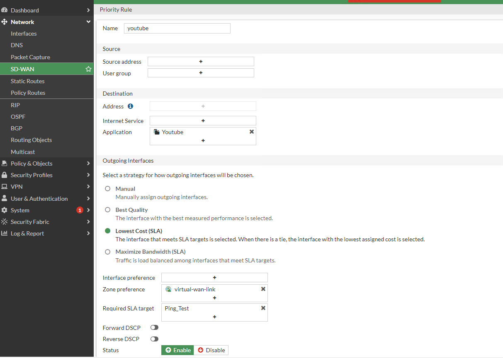

- [SD-WAN](#SD-WAN)
- [Interface](#Interface)
- [step 0.5 Interface  Role](#step0.5InterfaceRole)
- [step 1 SD-WAN Zones](#step1SD-WANZones)
- [step 2 Performance SLAs](#step2PerformanceSLAs)
- [step 3  SD-WAN Rules](#step3SD-WANRules)

# SD-WAN
####  SD-WAN
   
####  Interface

- the section sd-wan we are just foucus firewall 1 

- make sure whether interface wan both 2 can connect to the internet.

##  step 0.5 Interface  Role
#### This step just gives a name and role to interface 

##  step 1 SD-WAN Zones
#### This step is the same as combination interface both WAN1 and WAN2 is Virtual-wan 

##  step 2 Performance SLAs
#### This step is for creating performance measures, which we use for comparative performance between WAN1 and WAN2.

- It success

##  step 3  SD-WAN Rules
#### this step forces whether The application or destination out going to WAN1, WAN2, or load balance    

##### 2 example rule
###### rule 1 for YouTube If the user in LAN uses the YouTube system, It select WAN at lowest SLA
###### rule 2 for Facebook If the user in LAN uses the Facebook system, It select WAN 1 because it's static

- Youtube rule

- Facebook rule

# DHCP

