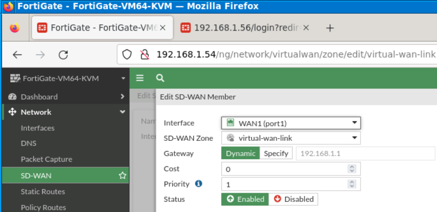

**FortiGate Lab**

[TOCM]

[TOC]

# SD-WAN
#### step 1 Interface  Role
#### step 2 SD-WAN Zones
#### step 3 Performance SLAs
#### step 4  SD-WAN Rules
# DHCP

- -------------------------------------------------------------------------

# SD-WAN
 #### This is topology for test in  lab, 
 

  - the section sd-wan we are just foucus firewall 1 
   
#### Interface

- make sure whether interface wan both 2 can connect to the internet.

#### step 1 Interface  Role

#### step 2 SD-WAN Zones

#### step 3 Performance SLAs

#### step 4  SD-WAN Rules

# DHCP

